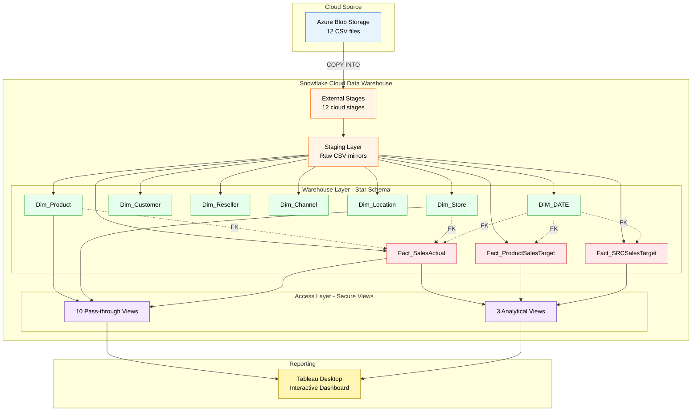
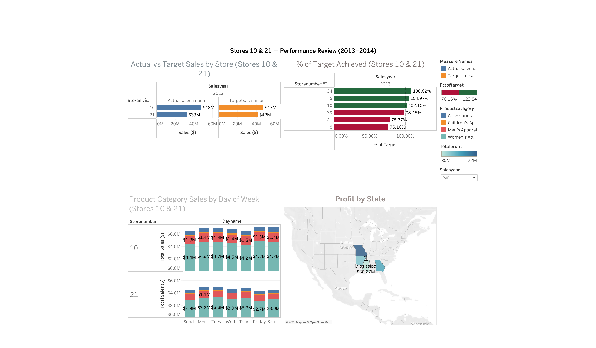
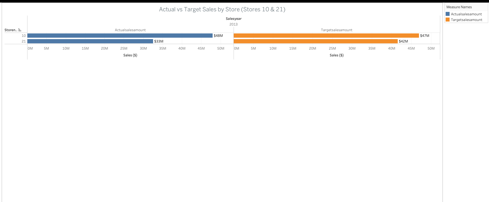
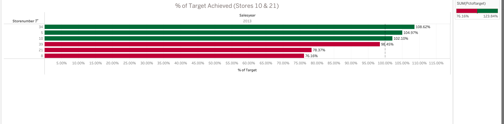
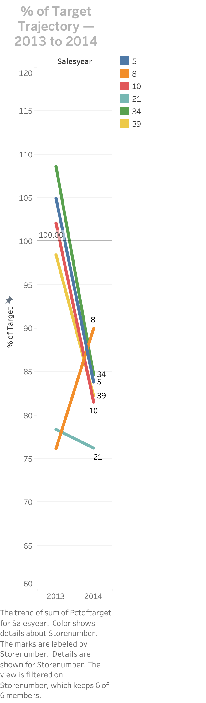
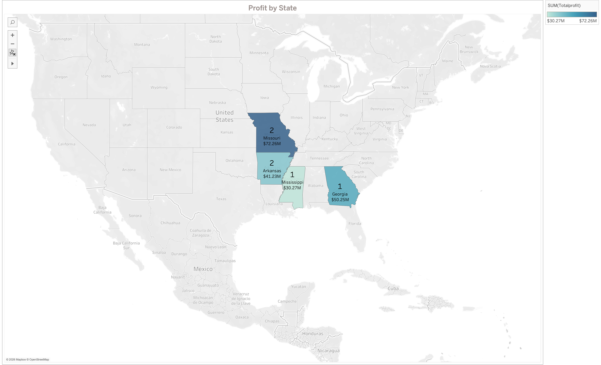

# Retail Sales BI — Cloud Data Warehouse & Dashboard

An end-to-end business intelligence project built on a modern cloud data stack. I designed and loaded a cloud data warehouse from raw CSV sources, modeled it dimensionally, and built an interactive Tableau dashboard that answers real business questions for a fictional retail chain.

---

## Overview

This project simulates a real-world BI engagement for a retail company. The pipeline ingests raw data from cloud storage, transforms it into a dimensional model, and surfaces insights through an interactive dashboard. The business asked four strategic questions; the dashboard and analysis deliver the answers.

**What makes this project cloud-based:** the data warehouse (Snowflake) and source storage (Azure Blob Storage) both run entirely in the cloud. Data moves cloud-to-cloud through Snowflake external stages, so no local processing is involved in the pipeline itself.

---

## Architecture

---

## Business Questions Answered

1. How are stores 10 and 21 performing against their targets, and will they hit 2014 goals?
2. How should a $2 million bonus pool be split across stores based on 2013 performance?
3. What day-of-week product sales trends exist at stores 10 and 21?
4. Should any new stores be opened? If so, where?

---

## Tech Stack

| Layer | Technology |
|---|---|
| Cloud data warehouse | Snowflake |
| Cloud source storage | Azure Blob Storage |
| ETL & modeling | SQL |
| Visualization | Tableau Desktop |

---

## What I Built

- A cloud data warehouse in Snowflake with staging, dimension, fact, and views layers
- Seven dimension tables and three fact tables modeled as a star schema with surrogate keys, foreign-key constraints, and unknown-member rows
- A SQL-based ETL pipeline that loads 12 raw CSVs from Azure Blob Storage into staging, then into dimensions, then into fact tables
- Thirteen secure views (ten pass-through views plus three analytical views) that insulate the dashboard from base-table changes
- A Tableau dashboard with four visualizations, a global year filter, and a click-to-filter interaction

---

## Key Findings

- Five of six stores declined in percent-of-target between 2013 and 2014, pointing to a portfolio-wide trend rather than isolated underperformance
- Atlanta is the strongest market by a wide margin, generating more than double the profit of the average Arkansas store
- My recommendation on new store expansion: delay until underperformers are addressed, then target Atlanta-style metros such as Nashville, Charlotte, or Birmingham

---

## Dashboard Preview

### Full Dashboard

### Actual vs Target Sales by Store

### % of Target Achieved by Store

### % of Target Achieved Trajectory by Year

### Product Category Sales by Day of Week

### Profit by State

---

## Repository Contents

| File | Purpose |
|---|---|
| `RetailSalesBI_STAGING.sql` | Creates the database, warehouse, Azure cloud stages, file format, and staging tables; loads raw CSV data |
| `RetailSalesBI_DIMENSION_LOADS.sql` | Creates and populates all dimension tables with surrogate keys and unknown-member rows |
| `RetailSalesBI_FACT_TABLE_LOADING.sql` | Creates fact tables with foreign-key constraints and loads them with null handling |
| `RetailSaleBI_VIEWS.sql` | Builds the secure views layer (pass-through + analytical) |
| `IMT577_Final_Visualizations.twbx` | Tableau workbook with the dashboard |
| `ERD.png` | Dimensional model diagram |
| `TECHNICAL.md` | Deep dive into architecture, ETL design, and key decisions |

---

## Technical Details

For a full walkthrough of the architecture, ETL approach, and design decisions, see [TECHNICAL.md](./TECHNICAL.md).

---

## About

Built as the capstone project for IMT 577 (Data Management for Business Intelligence) at the University of Washington Information School. The business scenario and source data were provided; the warehouse design, ETL implementation, analytical views, dashboard, and recommendations are my own work. I was responsible for the full data warehouse build and the new-store-expansion analysis.
